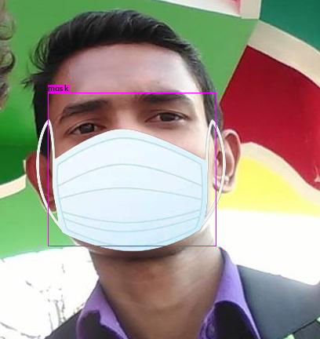

# MaskDetector
A simple face mask detector that can be run on Google colab. Model trained using yolov4

The [weights file](https://drive.google.com/file/d/1Fil8VJLGiEHlRk_iAeGepQgKbKB2xS79/view?usp=sharing) along with other files in this repo need to be uploaded in colab.
The model was trained on google colab using yolov4. 1400 iterations were done with 1486 images for training.

The model can be tested on both images and videos.

## Sample Output Images

.jpg)

## Model Details:

calculation mAP (mean average precision)...

detections_count = 3836, unique_truth_count = 1601 

class_id = 0, name = mask, ap = 99.11%   	 (TP = 840, FP = 38)

class_id = 1, name = no_mask, ap = 98.28%   	 (TP = 729, FP = 24) 

for conf_thresh = 0.25, precision = 0.96, recall = 0.98, F1-score = 0.97 

for conf_thresh = 0.25, TP = 1569, FP = 62, FN = 32, average IoU = 75.37 % 

IoU threshold = 50 %, used Area-Under-Curve for each unique Recall 

mean average precision (mAP@0.50) = 0.986944, or 98.69 % 

Total Detection Time: 33 Seconds

